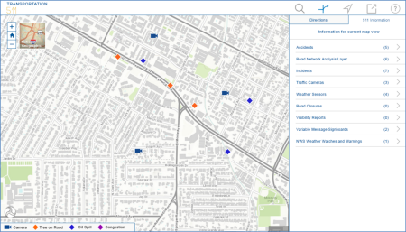

# transportation-511

***This transportation-511 repo has been replaced by the Info Summary widget in the [solutions-webappbuilder-widgets repo](https://github.com/Esri/solutions-webappbuilder-widgets) and the Transportation 511 script in the [511-script repo](https://github.com/Esri/511-Script). Applications built from this transportation-511 repo are in mature support.***

The Transportation 511 application is a configuration of ArcGIS for Server and a JavaScript application
that allows the public to find information about road conditions, 511 alerts, traffic incidents, et al.

## Features

* Information on road conditions
* Various 511 alerts
* Traffic incidents
* Alternate routing
* Proximity search of incidents/accidents within a certain distance of a route

## Instructions

### General Help
[New to Github? Get started here.](http://htmlpreview.github.com/?https://github.com/Esri/esri.github.com/blob/master/help/esri-getting-to-know-github.html)

## Requirements

* Microsoft ASP.NET Framework 4.0 available from the [Microsoft website](http://www.microsoft.com/en-us/download/details.aspx?id=17851)

### Your Services

* ArcGIS Online for Organizations or
* ArcGIS for Server 10.2 - Standard or Advanced - [About](http://www.esri.com/software/arcgis/arcgisserver)
* Microsoft ASP.NET Framework 4.0 available from the [Microsoft website](http://www.microsoft.com/en-us/download/details.aspx?id=17851)

## Resources

Learn more about Esri's [ArcGIS for State Government maps and apps](http://solutions.arcgis.com/state-government/).

Show me a list of other [Government GitHub repositories](http://esri.github.io/#Government).

This application uses the 3.8 version of
[Esri's ArcGIS API for JavaScript](http://help.arcgis.com/en/webapi/javascript/arcgis/);
see the site for concepts, samples, and a reference for using the API to create mapping web sites.

## Issues

Find a bug or want to request a new feature?  Please let us know by submitting an issue.

## Contributing

Esri welcomes contributions from anyone and everyone.
Please see our [guidelines for contributing](https://github.com/esri/contributing).

## Licensing

Copyright 2013 Esri

Licensed under the Apache License, Version 2.0 (the "License");
you may not use this file except in compliance with the License.
You may obtain a copy of the License at

   http://www.apache.org/licenses/LICENSE-2.0

Unless required by applicable law or agreed to in writing, software
distributed under the License is distributed on an "AS IS" BASIS,
WITHOUT WARRANTIES OR CONDITIONS OF ANY KIND, either express or implied.
See the License for the specific language governing permissions and
limitations under the License.

A copy of the license is available in the repository's
[LICENSE.txt](LICENSE.txt) file.

